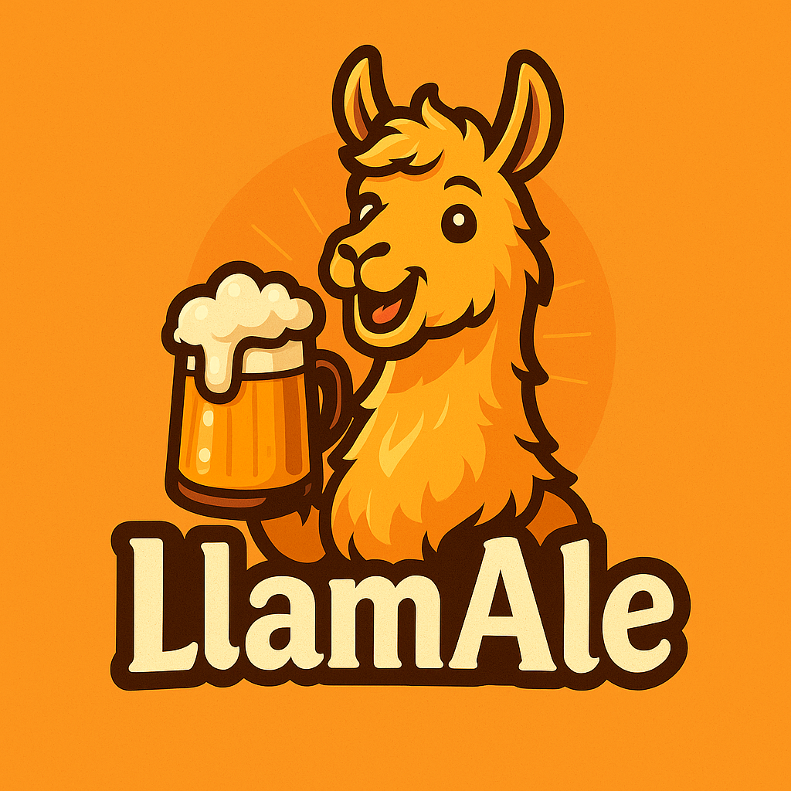

<div align="center">
  
  
  
</div>

<br/>

<h1 align="center">🍺 LlamAle</h1>
<p align="center">
  Human–Machine Dialogue System for Beer Discovery and Feedback  
  <br/>
  MSc Project – University of Trento – A.Y. 2024/2025  
</p>

<p align="center">
  Developed by:<br/>
  <strong>Pietro Bologna</strong>
</p>

<p align="center">
  
</p>

- [Overview](#overview)
  - [Key Features](#-key-features)
  - [ System Pipeline](#-system-pipeline)
- [Installation](#-installation)
- [Running the Chatbot](#-running-the-chatbot)
- [Contact](#-contact)

---

# Overview

**LlamAle** is a conversational assistant designed to guide users through the world of beer. From giving personalized recommendations to logging beer ratings, AleAgent simulates the behavior of a knowledgeable and friendly digital brewmaster.

You can interact naturally using requests like:

> _"I'm in the mood for a Belgian Tripel with low bitterness and high rating."_  
> _"What beers are brewed by Rochefort?"_  
> _"Can I rate Westmalle Dubbel? I'd give it a 4.8!"_

## 🚀 Key Features

✅ **Personalized Beer Recommendations** — Based on style, ABV, IBU, rating.  
✅ **Beer Lookup by Name or Brewery** — Get details and related suggestions.  
✅ **User Feedback Collection** — Record your beer ratings and comments.  
✅ **Short-Term Memory** — Tracks previous context and multi-turn goals.  
✅ **Multi-Intent Handling** — Processes more than one goal in a single input.

## 🧠 System Pipeline

LlamAle is powered by a modular dialogue architecture using **LLama3** via **Ollama**, designed around the NLU-DM-NLG loop.

1️⃣ **Pre-NLU**  
&emsp;Splits user input into multiple intents.

2️⃣ **Natural Language Understanding**  
&emsp;Extracts structured information (slots) for each intent.

3️⃣ **Dialogue Manager**  
&emsp;Maintains conversation state and determines the next action.

4️⃣ **Natural Language Generator**  
&emsp;Verbalizes decisions into natural, user-friendly responses.

---

## 🛠 Installation

> ℹ️ Requires Python 3.10+

Clone the project:

```bash
git clone https://github.com/bolognapietro/HumanMachineDialogue_LlamAle
cd HumanMachineDialogue_LlamAle
```

Create Virtual Environment and Install Dependencies:
```bash
python -m venv venv
pip install -r requirements.txt
```

Install Ollama and run the model:
```bash
ollama run llama3
```

## 💬 Running the Chatbot
Once the dataset and model are ready, you can launch the assistant with:
```bash
python main.py
```

```bash
python main.py
```

## 📫 Contact
For any questions or collaborations, feel free to contact:

Pietro Bologna – pietro.bologna@studenti.unitn.it